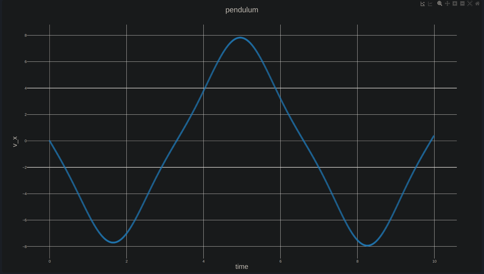
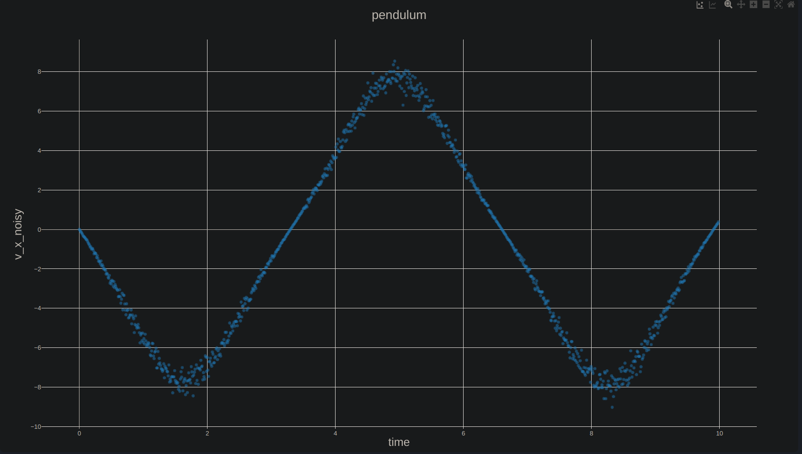

# pendulum-sim

A pendulum physics simulator written in C++. It generates the values of each physical quantity to describe it's movement based on initial values. It also generates data with noise, which will be later removed using the moving average method.

## Usage

`git clone` this repository or download it as a zip. Open the terminal in the directory called `.../pendulum-sim/`
and run:

```bash
$cd build/
$cmake ..
$cmake --build .
$./pendulum
```

See your results as a csv in the `output` directory.

> Note: You can edit the initial conditions in the const variables at the beginning of `src/main.cpp`.

## Examples

These are test runs visualized with [CSV Plot](csvplot.com).

Without noise:


With noise:

